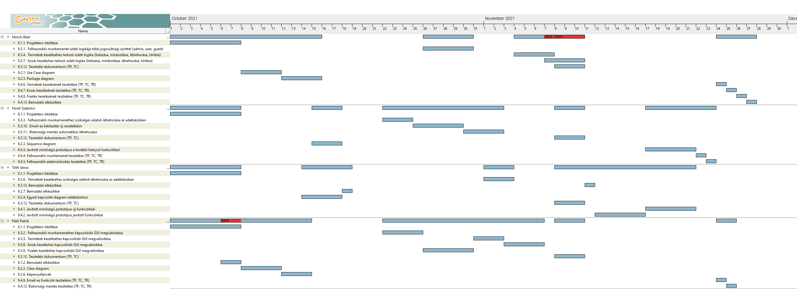

# Webshop Projektterv 2021

## 1. Összefoglaló 

 Egy webshop ebben a pandémiás időszakban elengethetetlen. Egy-egy nagy áruház ha rendelkezik webshoppal képes a polcokon lévő termékeket akár percek alatt, vagy akár egy előre egyeztetett időpontra az otthonunk ajtajába kiszállítani. 
 Azonban minden egy átlátható, felhasználóbarát felületnek kell lennie, hogy az egyszerű vásárló is kényelmesen el tudjon rajta igazodni. Egy helyen megtalálható az összes termék és egyben leírásuk, különböző akciók, promóciók.
 Egy gyors regisztrációt követve képesek vagyunk saját kosarunk megtekintésére, termékek kiválasztására, majd a fizetés és szállítás meghatározására. Több üzlet közül ki tudjuk választani a nekünk legszimpatikusabbat, majd akár házhoz rendelni, vagy az üzletnél át tudjuk venni a termékeket.
 Gyors, egyszerű és akár a kanapéról el lehet végezni a heti teljeskörű bevásárlást, ha rendelkezésre áll egy megfelelően előállított webshop. 

## 2. Verziók

| Verzió | Szerző(k)                | Dátum        | Státusz         | Megjegyzés                                                    |
|--------|--------------------------|--------------|-----------------|---------------------------------------------------------------|
|  0.1   |  Tóth János              |  2021-10-01  |  Tervezet       |  Legelső verzió                                               |
|  0.2   |  Mindenki                |  2021-10-07  |  Előterjesztés  |  A projekt menedzsere jónak találta                           |

Státusz osztályozás:
 - Tervezet: befejezetlen dokumentum, a mérföldkő leadása előtti napokban
 - Előterjesztés: a projekt menedzser bírálatával, a mérföldkő határidejekor
 - Elfogadott: a megrendelő által elfogadva, a prezentáció bemutatásakor

## 3. A projekt bemutatása

Ez a projektterv a Webshop projektet mutatja be, mely 2021-10-01-től 2021-12-02-ig tart. A projekt célja, hogy megfelelő felületet biztosítson a rendelések online elvégzésére és az áru adatok nyilvántartására. Mindezért egy egyszerűen használható, átlátható és hatékonyan működő webalkalmazás fog felelni. A projekten négy fő fejlesztő fog dolgozni, az elvégzett feladatokat pedig négy alkalommal fogjuk prezentálni a megrendelőnek.

### 3.1. Rendszerspecifikáció

A rendszernek képesnek kell lennie arra, hogy adott felhasználó adatait és a rendeléseket nyilvántartsa. Ezen kívül a termékek állapotára és a felhasználói jogosultságok kezelésére is. A termékeket lehet szűrni, keresni. A jelenlegi kosár tartalma módosítható és nyomon követhető. A rendelést bejelentkezés után lehet végrehajtani. Minden funkció a megfelelő felhasználói jogosultság mellett használható, annak függvényében megváltoztatható, olvasható vagy nem megtekinthető az adat.

### 3.2. Funkcionális követelmények

 - Felhasználói munkamenet megvalósítása több jogosultsági szinttel (admin, user, guest)
 - Felhasználók kezelése (CRUD)
 - Termékek kezelése (CRUD)
 - Kosár kezelése (CRUD)
 - Termékek keresése/szűrése
 - Email-es kiértesítés új rendeléskor
 - Biztonsági mentés automatikus létrehozása

### 3.3. Nem funkcionális követelmények

 - A kliens oldal platform- és böngészőfüggetlen legyen
 - Reszponzív megjelenés
 - Szenzitív adatokat biztonságosan tároljuk
 - A legfrissebb technológiákat használja a rendszer

## 4. Költség- és erőforrás-szükségletek

Az erőforrásigényünk összesen kb. 12 személynap/fő.

A rendelkezésünkre áll összesen 4 * 70 = 280 pont.

## 5. Szervezeti felépítés és felelősségmegosztás
A projekt megrendelője Márkus András. A Webshop projektet a projektcsapat fogja végrehajtani, amely jelenleg 4 fejlesztőből áll. A csapatban található négy munktapasztalat nélküli szoftverfejlesztő.
 - Honti Szabolcs
 - Hirsch Ábel
 - Pető Patrik
 - Tóth János

### 5.1 Projektcsapat
A projekt a következő emberekből áll:

|                                                                                                                   | Név             | E-mail cím (stud-os)       |
|-------------------------------------------------------------------------------------------------------------------|-----------------|----------------------------|
| Megrendelő                                                                                                        | Márkus András   | markusa@inf.u-szeged.hu  |
| Felelősségek: Projekt menedzser, Adatbázis és adatkapcsolatok, A rendszer működési logikája    		    | Hirsch Ábel     | h045844@stud.u-szeged.hu |
| Felelősségek: Felhasználói felületek                                                  			    | Pető Patrik     | h050368@stud.u-szeged.hu |
| Felelősségek: Dokumentáció                                                                            	    | Honti Szabolcs  | h045923@stud.u-szeged.hu |
| Felelősségek: Prezentációk											    | Tóth János      | h985829@stud.u-szeged.hu |

## 6. A munka feltételei

### 6.1. Munkakörnyezet
A projekt a következő munkaállomásokat fogja használni a munka során:
 - Munkaállomások: 4 db PC Windows 10-es operációs rendszerrel
 - Asztali számítógép (CPU: Ryzen 5 5600x, RAM: 16GB, GPU: Nvidia GTX750)
 - Asus FX504GD (CPU: i5 8300H RAM: 8GB, GPU: Nvidia GTX1050)
 - Lenovo Ideapad S145 laptop (CPU: i5 - 1035G1, RAM: 8GB, GPU: Intel UHD Graphics)
 - Asztali számítógép (CPU: i5 9600K, RAM: 16GB, GPU: Nvidia GTX1660TI)

A projekt a következő technológiákat/szoftvereket fogja használni a munka során: 
 - Heroku platformszolgáltatás
 - Heroku által biztosított PostgreSQL adatbázisszerver
 - Spring Boot (backend)
 - React.js (frontend)
 - Maven szoftverprojekt menedzselő szoftver
 - Eclipse IDE
 - Visual Studio Code
 - Git verziókövető (GitLab)

### 6.2. Rizikómenedzsment

| Kockázat                                    | Leírás                                                                                                                                                                                     | Valószínűség | Hatás  |
|---------------------------------------------|--------------------------------------------------------------------------------------------------------------------------------------------------------------------------------------------|--------------|--------|
| Betegség                                  | Súlyosságtól függően hátráltatja vagy bizonyos esetekben teljes mértékben korlátozza a munkavégzőt, így az egész projektre kihatással van. Megoldás: a feladatok átcsoportosítása        | nagy       | erős |
| Kommunikációs fennakadás a csapattagokkal | A csapattagok között nem elégséges az információ áramlás, nem pontosan, esetleg késve vagy nem egyértelműen tájékoztatjuk egymást. Megoldás: még gyakoribb megbeszélések és ellenőrzések | kis        | közepes |

## 7. Jelentések

### 7.1. Munka menedzsment
A munkát Hirsch Ábel koordinálja. Fő feladata, hogy a programozók által jónak talált feladatok megoldását ellenőrizze, és véglegesítse. Ezen kívül ő szolgáltatja a szükséges információt a csapattagok számára, legyen az bármivel kapcsolatos (projekthez kapcsolódóan). A heti gyűléseket egy segéd alkalmazás felhasználásával (Discord) online vezeti.

### 7.2. Csoportgyűlések

A projekt hetente ülésezik, hogy megvitassák az azt megelőző hét problémáit, illetve hogy megbeszéljék a következő hét feladatait. A megbeszélésről minden esetben memó készül.

1. megbeszélés:
 - Időpont: 2021.10.01.
 - Hely: Online
 - Résztvevők: Tóth János, Hirsch Ábel, Pető Patrik, Honti Szabolcs
 - Érintett témák: Projektterv megkezdése

2. megbeszélés:
 - Időpont: 2021.10.03.
 - Hely: Online
 - Résztvevők: Tóth János, Hirsch Ábel, Pető Patrik, Honti Szabolcs
 - Érintett témák: Projektterv kitöltésének folytatása
 
3. megbeszélés:
 - Időpont: 2021.10.06.
 - Hely: Online
 - Résztvevők: Tóth János, Hirsch Ábel, Pető Patrik, Honti Szabolcs
 - Érintett témák: Projektterv befejezése

4. megbeszélés:
 - Időpont: 2021.10.07.
 - Hely: Online
 - Résztvevők: Tóth János, Hirsch Ábel, Pető Patrik, Honti Szabolcs
 - Érintett témák: Projektterv javítása, Bemutató elkészítése

5. megbeszélés:
 - Időpont: 2021.10.08.
 - Hely: Online
 - Résztvevők: Hirsch Ábel, Pető Patrik
 - Érintett témák: Projektterv javítása a megrendelő kérésére

### 7.3. Minőségbiztosítás

Az elkészült terveket a terveken nem dolgozó csapattársak közül átnézik, hogy megfelel-e a specifikációnak és az egyes diagramtípusok összhangban vannak-e egymással. A meglévő rendszerünk helyes működését a prototípusok bemutatása előtt a tesztelési dokumentumban leírtak végrehajtása alapján ellenőrizzük és összevetjük a specifikációval, hogy az elvárt eredményt kapjuk-e. További tesztelési lehetőségek: unit tesztek írása az egyes modulokhoz vagy a kód közös átnézése (code review) egy, a vizsgált modul programozásában nem résztvevő csapattaggal. Szoftverünk minőségét a végső leadás előtt javítani kell a rendszerünkre lefuttatott kódelemzés során kapott metrikaértékek és szabálysértések figyelembevételével.
Az alábbi lehetőségek vannak a szoftver megfelelő minőségének biztosítására:
- Specifikáció és tervek átnézése (kötelező)
- Teszttervek végrehajtása (kötelező)
- Unit tesztek írása (választható)
- Kód átnézése (választható)

### 7.4. Átadás, eredmények elfogadása

A projekt eredményeit Márkus András fogja elfogadni. A projektterven változásokat csak Hirsch Ábel írásos kérése esetén Márkus András engedélyével lehet tenni. A projekt eredményesnek bizonyul, ha specifikáció helyes és határidőn belül készül el. Az esetleges késések pontlevonást eredményeznek.
Az elfogadás feltételeire és beadás formájára vonatkozó részletes leírás a következő honlapon olvasható: https://okt.sed.hu/rf1/

### 7.5. Státuszjelentés

Minden leadásnál a projektmenedzser jelentést tesz a projekt haladásáról, és ha szükséges változásokat indítványoz a projektterven. Ezen kívül a megrendelő felszólítására a menedzser 3 munkanapon belül köteles leadni a jelentést. A gyakorlatvezetővel folytatott csapatmegbeszéléseken a megadott sablon alapján emlékeztetőt készít a csapat, amit a következő megbeszélésen áttekintenek és felmérik az eredményeket és teendőket. Továbbá gazdálkodnak az erőforrásokkal és szükség esetén a megrendelővel egyeztetnek a projektterv módosításáról.

## 8. A munka tartalma

### 8.1. Tervezett szoftverfolyamat modell és architektúra

A szoftver fejlesztése során az agilis fejlesztési modellt alkalmazzuk. A fejlesztés során nagy hangsúlyt fektetünk a folyamatos kommunikcióra. A fejlesztés során a szoftver specifikációi rugalmasan vátozhatnak, és ezzel a módszertannal tudunk a leggyorsabban alkalmazkodni az új elvárásokhoz.

A szoftver MVC alapú REST webszolgáltatásként működik. A szerver és a kliens függetlenek, csupán API végpontok segítségével kommunikálnak.

### 8.2. Átadandók és határidők
A főbb átadandók és határidők a projekt időtartama alatt a következők:

| Szállítandó |                 Neve                |   Határideje  |
|:-----------:|:-----------------------------------:|:-------------:|
|      D1     |       Projektterv és útmutató       | 2021-10-07  |
|    P1+D2    | UML, DB, képernyőtervek és bemutató | 2021-10-21  |
|    P1+D3    |      Prototípus I. és bemutató      | 2021-11-11  |
|    P2+D4    |      Prototípus II. és bemutató     | 2021-12-02  |

## 9. Feladatlista

A következőkben a tervezett feladatok részletes összefoglalása található.

### 9.1. Projektterv (1. mérföldkő)

Ennek a feladatnak az a célja, hogy megvalósításhoz szükséges lépéseket, az ütemzést és a felelősöket meghatározzuk.

Részfeladatai a következők:

#### 9.1.1. Projektterv kitöltése

Felelős: Mindenki

Tartam:  7 nap

Erőforrásigény:  1 személynap/fő

#### 9.1.2. Bemutató elkészítése

Felelős: Pető Patrik

Tartam:  2 nap

Erőforrásigény:  1 személynap

### 9.2. UML és adatbázis tervek (2. mérföldkő)

Ennek a feladatnak az a célja, hogy a rendszerarchitektúrát, az adatbázist és webalkalmazás kinézetét megtervezzük.

Részfeladatai a következők:

#### 9.2.1. Use Case diagram

Felelős: Honti Szabolcs

Tartam:  4 nap

Erőforrásigény:  1 személynap

#### 9.2.2. Class diagram

Felelős: Pető Patrik

Tartam:  4 nap

Erőforrásigény:  2 személynap

#### 9.2.3. Sequence diagram

Felelős: Honti Szabolcs

Tartam:  3 nap

Erőforrásigény:  1 személynap

#### 9.2.4. Egyed-kapcsolat diagram adatbázishoz

Felelős: Hirsch Ábel

Tartam:  4 nap

Erőforrásigény:  2 személynap

#### 9.2.5. Package diagram

Felelős: Tóth János

Tartam:  4 nap

Erőforrásigény:  1 személynap

#### 9.2.6. Képernyőtervek

Felelős: Pető Patrik

Tartam:  3 nap

Erőforrásigény:  1 személynap

#### 9.2.7. Bemutató elkészítése

Felelős: Tóth János

Tartam:  1 nap

Erőforrásigény:  1 személynap

### 9.3. Prototípus I. (3. mérföldkő)

Ennek a feladatnak az a célja, hogy egy működő prototípust hozzunk létre, ahol a vállalt funkcionális követelmények nagy része már prezentálható állapotban van.

Részfeladatai a következők:

#### 9.3.1.  Regisztrációhoz, bejelentkezéshez és profilhoz tartozó GUI készítése

Felelős: Pető Patrik

Tartam:  4 nap

Erőforrásigény:  2 személynap

#### 9.3.2.  Felhasználói adatbázisok elkészítése

Felelős: Tóth János

Tartam:  3 nap

Erőforrásigény:  1 személynap

#### 9.3.3.  Felhasználói adatok létrehozása az adatbázisban

Felelős: Honti Szabolcs

Tartam:  2 nap

Erőforrásigény:  1 személynap

#### 9.3.4.  Termékek megjelenítéséhez kapcsolódó GUI megvalósítása

Felelős: Pető Patrik

Tartam:  3 nap

Erőforrásigény:  2 személynap

#### 9.3.5.  Termékek kezeléséhez kapcsolódó GUI megvalósítása (módosítása, létrehozása, törlése)

Felelős: Honti Szabolcs

Tartam:  4 nap

Erőforrásigény:  2 személynap

#### 9.3.6.  Termékek kezeléséhez tartozó üzleti logika (módosítása, létrehozása, törlése)

Felelős: Hirsch Ábel

Tartam:  4 nap

Erőforrásigény:  2 személynap

#### 9.3.7.  Termékek létrehozása az adatbázisban

Felelős: Tóth János

Tartam:  2 nap

Erőforrásigény:  1 személynap

#### 9.3.8.  Kereséshez/szűréshez kapcsolódó GUI megvalósítása

Felelős: Pető Patrik

Tartam:  3 nap

Erőforrásigény:  2 személynap

#### 9.3.9.  Termékek kereséséhez/szűréséhez tartozó üzleti logika

Felelős: Hirsch Ábel

Tartam:  4 nap

Erőforrásigény:  2 személynap

#### 9.3.10.  Kosárhoz kapcsolódó GUI megvalósítása

Felelős: Tóth János

Tartam:  3 nap

Erőforrásigény:  2 személynap

#### 9.3.11.  Kosár kezeléshez tartozó üzleti logika (listázása, módosítása, létrehozása, törlése)

Felelős: Hirsch Ábel

Tartam:  3 nap

Erőforrásigény:  2 személynap

#### 9.3.12.  Fizetéshez kapcsolódó GUI megvalósítása

Felelős: Pető Patrik

Tartam:  3 nap

Erőforrásigény:  2 személynap

#### 9.3.13.  Rendelés kezeléshez tartozó üzleti logika (listázása, létrehozása)

Felelős: Hirsch Ábel

Tartam:  3 nap

Erőforrásigény:  2 személynap

#### 9.3.14.  Email-es kiértesítés új rendeléskor

Felelős: Honti Szabolcs

Tartam:  4 nap

Erőforrásigény:  2 személynap

#### 9.3.15.  Biztonsági mentés automatikus létrehozása

Felelős: Honti Szabolcs

Tartam:  4 nap

Erőforrásigény:  2 személynap

#### 9.3.16. Tesztelési dokumentum (TP, TC)

Felelős: Mindenki

Tartam:  3 nap

Erőforrásigény:  1 személynap/fő

#### 9.3.17. Bemutató elkészítése 

Felelős: Tóth János

Tartam:  1 nap

Erőforrásigény:  1 személynap

### 9.4. Prototípus II. (4. mérföldkő)

Ennek a feladatnak az a célja, hogy az előző mérföldkő hiányzó funkcióit pótoljuk, illetve a hibásan működő funkciókat és az esetlegesen felmerülő új funkciókat megvalósítsuk. Továbbá az alkalmazás alapos tesztelése is a mérföldkőben történik.

Részfeladatai a következők:

#### 9.4.1. Javított minőségű prototípus új funkciókkal

Felelős: Tóth János

Tartam:  5 nap

Erőforrásigény:  1 személynap

#### 9.4.2. Javított minőségű prototípus javított funkciókkal

Felelős: Tóth János

Tartam:  5 nap

Erőforrásigény:  2 személynap

#### 9.4.3. Javított minőségű prototípus a korábbi hiányzó funkciókkal

Felelős: Honti Szabolcs

Tartam:  5 nap

Erőforrásigény:  2 személynap

#### 9.4.4. Felhasználói munkamenet tesztelése (TP, TC, TR)

Felelős: Honti Szabolcs

Tartam:  1 nap

Erőforrásigény:  0.3 személynap

#### 9.4.5. Felhasználói adatmódosítás tesztelése (TP, TC, TR)

Felelős: Honti Szabolcs

Tartam:  1 nap

Erőforrásigény:  0.3 személynap

#### 9.4.6. Termékek kezelésének tesztelése (TP, TC, TR)

Felelős: Hirsch Ábel

Tartam:  1 nap

Erőforrásigény:  0.3 személynap

#### 9.4.7. Kosár kezelésének tesztelése (TP, TC, TR)

Felelős: Hirsch Ábel

Tartam:  1 nap

Erőforrásigény:  0.3 személynap

#### 9.4.8. Fizetés kezelésének tesztelése (TP, TC, TR)

Felelős: Hirsch Ábel

Tartam:  1 nap

Erőforrásigény:  0.3 személynap

#### 9.4.9. Email-es funkciók tesztelése (TP, TC, TR)

Felelős: Pető Patrik

Tartam:  1 nap

Erőforrásigény:  0.3 személynap

#### 9.4.12. Biztonsági mentés tesztelése (TP, TC, TR)

Felelős: Pető Patrik

Tartam:  1 nap

Erőforrásigény:  0.3 személynap

#### 9.4.13. Bemutató elkészítése 

Felelős: Tóth János

Tartam:  1 nap

Erőforrásigény:  1 személynap

## 10. Részletes időbeosztás

|                     Név                    |            Szín          |
|:------------------------------------------:|:------------------------:|
|                     Mindenki               |            Sárga         |
|                     Honti Szabolcs         |            Kék           |
|                     Hirsch Ábel            |            Lila          |
|                     Pető Patrik            |            Zöld          |
|                     Tóth János             |            Piros         |

## 11. Projekt költségvetés

### 11.1. Részletes erőforrásigény (személynap)

|                     Név                    | 1. leadás - Projektterv | 2. leadás - UML és adatbázis | 3. leadás - Prototípus I. | 4. leadás - Prototípus II. | Összesen |
|:------------------------------------------:|:----------------------:|:--------------------------:|:-----------------------:|:------------------------:|:---------:|
|                     Honti Szabolcs         |            1           |              2             |            8            |            2.6           |    13.6   |
|                     Hirsch Ábel            |            1           |              2             |            9            |            0.9           |    12.9   |
|                     Pető Patrik            |            2           |              3             |            9            |            0.6           |    14.6   |
|                     Tóth János             |            1           |              2             |            6            |             4            |    13     |

### 11.2. Részletes feladatszámok

|                     Név                    | 1. leadás - Projektterv | 2. leadás - UML és adatbázis | 3. leadás - Prototípus I. | 4. leadás - Prototípus II. | Összesen |
|:------------------------------------------:|:----------------------:|:--------------------------:|:-----------------------:|:------------------------:|:---------:|
|                     Honti Szabolcs         |            1           |              2             |            5            |             3            |     11    |
|                     Hirsch Ábel            |            1           |              1             |            5            |             3            |     10    |
|                     Pető Patrik            |            2           |              2             |            5            |             2            |     11    |
|                     Tóth János             |            1           |              2             |            5            |             3            |     11    |

### 11.3. Részletes költségvetés

|                     Név                       | 1. leadás - Projektterv | 2. leadás - UML és adatbázis | 3. leadás - Prototípus I. | 4. leadás - Prototípus II. | Összesen |
|:---------------------------------------------:|:----------------------:|:--------------------------:|:-----------------------:|:------------------------:|:---------:|
|        Maximálisan választható pontszám %-ban |         10% (7)        |            30% (21)        |          50% (35)       |          30% (21)        | 100% (70) |
|                     Honti Szabolcs            |           5            |             13             |          33             |            19            |    70     |
|                     Hirsch Ábel               |           6            |             15             |          33             |            16            |    70     |
|                     Pető Patrik               |           7            |             18             |          35             |            10            |    70     |
|                     Tóth János                |           6            |             19             |          24             |            21            |    70     |

Szeged, 2021-10-07.
